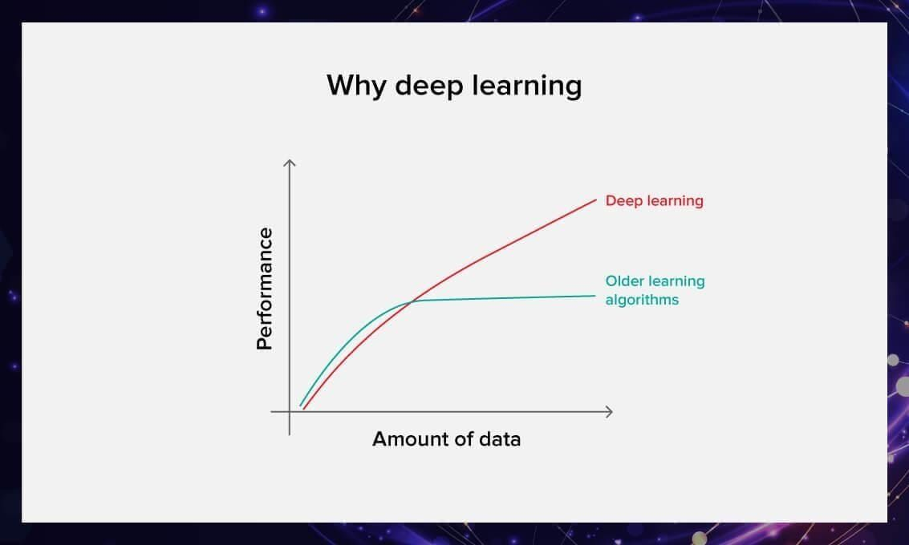

# Fundamentals of Deep Learning

## Neural Networks 
Neural networks are the fundamental building blocks  of deep learning. They are inspired by the structure and function of the human brain and consist of interconnected nodes called neurons. These neurons receive input, perform computations, and pass the results to other neurons. The network learns by adjusting the strenght of the connections between neurons, known as weights, during the training process.

Neural Networks can learn complex patterns and relationships in data by processing information through multiple layers. The input layer receive the data, and the output layer produces the predicted result. Between these two layers are one or more hidden layers where the actual learning takes place.

## Deep Learning
Deep learning is a subset of machine learning that specifically utilizes neural networks with multiple hidden layers, often referred to as deep neural networks. These deep architectures allow for the learning of complex patterns and hierarchical representation of data, making deep learning particularly effective for tasks involving large amounts of unstructured data, such as images, audio, and text. Deep learning models generally require significant computational resources and large datasets to perform well. 

Usually, deep learning is unsupervised or semi-supervised. Deep learning is based on representation learning. Instead of using task-specific algorithms, it learns from representative examples. For example, if you want to build a model that recognizes cats by species, you need to prepare a database that includes a lot of different cat images.

## Difference Between Machine Learning and Deep Learning
| Deep Learning | Machine Learning |
|---------------|------------------|
| large amount of data | small amount of dataset but high-quality
| take much longer to train | can be trained in a reduced amount of time |
| computation-heavy | not always | 
| an draw accurate conclusion from raw data | carefully pre-processed data |
| can be used in unexpected ways | algorithm is built to solve a specific problem |

## Advantages of Deep Learning 
- In 2015, a group of Google engineers was conducting research about how NN carry out classification tasks. By chance, they also noticed that neural networks can hallucinate and produce rather interesting art.
- Deep learning doesn’t rely on human expertise as much as traditional machine learning. DL allows us to make discoveries in data even when the developers are not sure what they are trying to find. For example, you want your algorithms to be able to predict customer retention, but you’re not sure which characteristics of a customer will enable the system to make this prediction.

## Key Differences of Neural Networks and Deep Learning 
- **Architecture**: Neural networks can be shallow (few layers), while deep learning models are characterized by having many hidden layers, enabling them to learn more abstract features from data.
- **Complexity and Performance**: Deep learning systems typically outperform traditional neural network on complex tasks due to their ability to process and learn from vast amounts of data.
- **Data Requirements**: Deep learning models generally require larger datasets to achieve optimal performance, whereas simpler neural networks can work with smaller datasets, albeit with limited effectiveness on complex tasks.

## Deep Learning Frameworks 
Deep learning frameworks provide a structured environment for building, training, and deploying neural networks. Some popular  deep learning frameworks include:
- PyTorch
- TensorFlow
- Keras 
- Caffe

## Convulational Neural Networks (CNNs)
Convolutional Neural Networks (CNNs) are a special type of neural network designed for processing grid-like data, such as images. CNNs exploit the spatial structure of the input data by learning local patterns and hierarchical representations.

The key components of a CNN are:
- **Convolutional layers**: Apply a set of learnable filters to the input image, producing feature maps.
- **Pooling layers**: Reduce the spatial size of the feature maps, reducing the number of parameters and computations.
- **Fully connected layers**: Connect all neurons from the previous layer to produce the final output.

CNNs have revolutionized the field of computer vision, achieving state-of-the-art performance on tasks such as image classification, object detection, and semantic segmentation. They have been successfully applied to various domains, including medical imaging, autonomous vehicles, and natural language processing.

##  Resources 
- [A Guide to Deep Learning and Neural Networks](https://serokell.io/blog/deep-learning-and-neural-network-guide)
